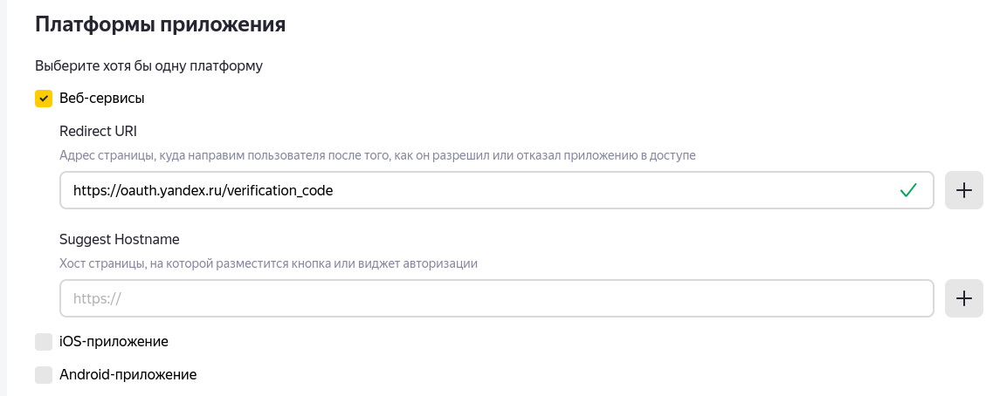
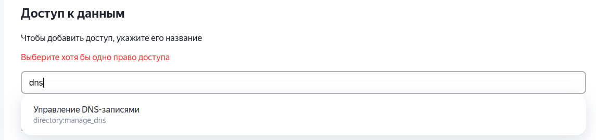

# certbot-dns-yandex360

Yandex 360 API for certbot `--manual-auth-hook` `--manual-cleanup-hook`

Install and renew Let's encrypt wildcard SSL certificate for domain \*.site.com using Yandex 360 API:

#### 1. Clone this repo and set the OAuth Token

```bash
git clone https://github.com/solodyagin/certbot-dns-yandex360.git && cd ./certbot-dns-yandex360
```

#### 2. Set OAuth Token

Get your Yandex 360 API OAuth token and Organization ID

Documentation is here https://yandex.ru/dev/api360/doc/ru/

How to get API key :

> - Go https://oauth.yandex.ru/client/new/
> - Set name
> - Choose platform and set "Redirect URI" as https://oauth.yandex.ru/verification_code 
> - Add permissions for change DNS 
> - Set your email
> - Create Application
> - Then go https://oauth.yandex.ru/authorize?response_type=token&client_id=$CLIENT_ID  
>   where $CLIENT_ID is ClientID of your created app from https://oauth.yandex.ru/.  
>   Now you have $OAUTH_TOKEN for authentificator.
> - Get get your $ORG_ID from https://admin.yandex.ru/company-profile in bottom-left angle of page.

```bash
nano ./config.sh
```

#### 3. Generate wildcard

```bash
sudo certbot certonly \
    --agree-tos \
    --server https://acme-v02.api.letsencrypt.org/directory \
    --preferred-challenges dns-01
    --manual-auth-hook ../certbot-dns-yandex360/authenticator.sh \
    --manual-cleanup-hook ../certbot-dns-yandex360/cleanup.sh \
    --manual \
    --email info@site.com \
    -d *.site.com
```

#### 4. Force Renew

```bash
certbot renew \
    --force-renew \
    --agree-tos \
    --server https://acme-v02.api.letsencrypt.org/directory \
    --preferred-challenges dns-01 \
    --manual \
    --manual-auth-hook ../certbot-dns-yandex360/authenticator.sh \
    --manual-cleanup-hook ../certbot-dns-yandex360/cleanup.sh
```
