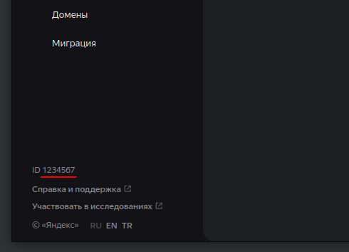

# certbot-dns-yandex360

Скрипты для получения wildcard-сертификата от Let's Encrypt для домена, делегированного Яндекс 360 для бизнеса.

#### 1. Установите зависимости

```bash
sudo apt install curl jq
```

#### 2. Склонируйте репозиторий

```bash
git clone https://github.com/solodyagin/certbot-dns-yandex360.git
cd ./certbot-dns-yandex360
```

#### 3. Укажите учётные данные

##### Получите доступ к Яндекс 360 API (подробнее в [документации](https://yandex.ru/dev/api360/doc/ru/))

> - Перейдите на страницу создания приложения https://oauth.yandex.ru/client/new/
> - Введите произвольное название сервиса
> - Выберите платформу и в поле "Redirect URI" укажите `https://oauth.yandex.ru/verification_code` <p></p>
> - Добавьте разрешение на управление DNS-записями <p></p>
> - Укажите ваш email
> - Создайте приложение
> - Перейдите на страницу https://oauth.yandex.ru/authorize?response_type=token&client_id=$CLIENT_ID \
>   где $CLIENT_ID - это идентификатор созданного приложения ClientID (https://oauth.yandex.ru)
> - Теперь у вас есть $OAUTH_TOKEN для аутентификатора

##### Получите идентификатор организации

> - Перейдите на страницу https://admin.yandex.ru/company-profile
> - Найдите ID в левом нижнем углу страницы <p></p>
> - Теперь у вас есть $ORG_ID

##### Внесите полученные данные в `config.sh`

```bash
nano ./config.sh
```

#### 4. Сгенерировать wildcard-сертификат

Вместо `example.com` укажите свой домен

```bash
sudo certbot certonly \
	-d "example.com" \
	-d "*.example.com" \
	--email info@example.com \
	--agree-tos \
	--preferred-challenges dns \
	--manual \
	--manual-auth-hook ../certbot-dns-yandex360/authenticator.sh \
	--manual-cleanup-hook ../certbot-dns-yandex360/cleanup.sh
```

#### 5. Выпустить новый сертификат

```bash
certbot renew \
	--force-renew \
	--agree-tos \
	--preferred-challenges dns \
	--manual \
	--manual-auth-hook ../certbot-dns-yandex360/authenticator.sh \
	--manual-cleanup-hook ../certbot-dns-yandex360/cleanup.sh
```
